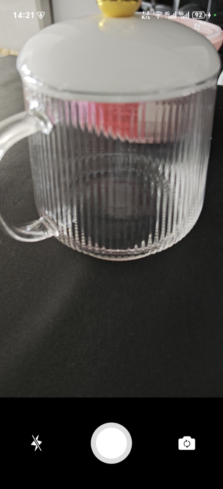
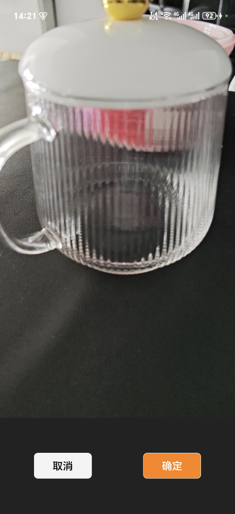

# CameraX一个拍照、录像工具

点击拍照，长按录像，支持对焦、放大操作。

## 效果图




## 使用方法

1.将 JitPack 存储库添加到build文件中

```groovy
dependencyResolutionManagement {
    repositoriesMode.set(RepositoriesMode.FAIL_ON_PROJECT_REPOS)
    repositories {
        ...
        maven { url 'https://jitpack.io' }
    }
}
```

2.添加依赖

```groovy
dependencies {
    implementation 'com.github.NaclFire:CameraX:1.0.0'
}
```

3.调用

```java
new CameraXActivity.Builder()
        .setMaxTime(30)// 最长录制时间，默认30秒
        .setMinTime(2)// 最短录制时间，可选，默认0
        .setSaveFolder("MyApp")// 保存文件夹名，位于DCIM目录下，默认为应用名。
        .setOnCameraCallback(new CameraXActivity.OnCameraCallback() {
    @Override
    public void onCameraResult(CameraResultBean cameraResultBean) {
      	// cameraResultBean结构：
      	// path：文件绝对路径
      	// type：类型：CAMERA_RESULT_TYPE_PHOTO、CAMERA_RESULT_TYPE_VIDEO
      	// uri：媒体文件Uri
    }
}).build(MainActivity.this);
```

注意：compileSdk和targetSdk版本需要大于33          
